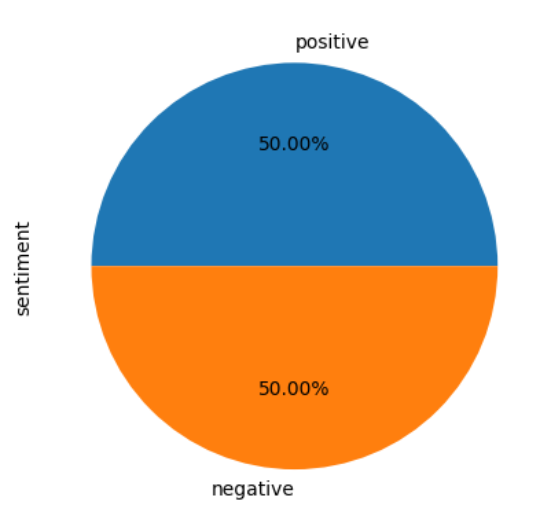
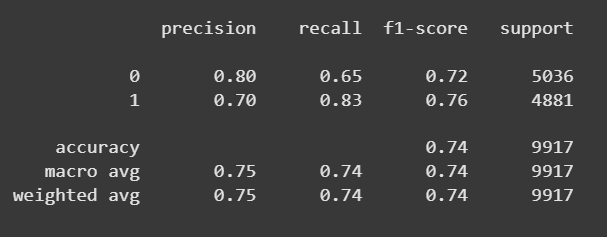
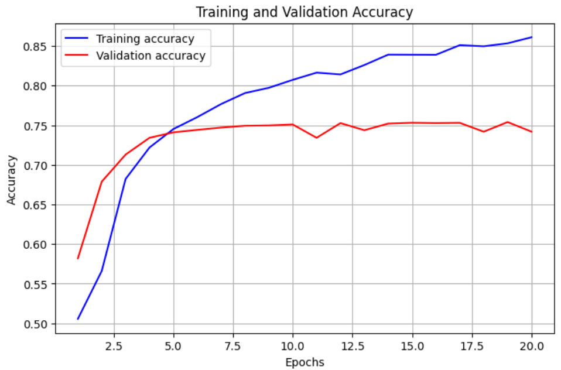
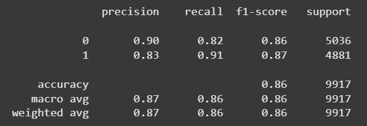
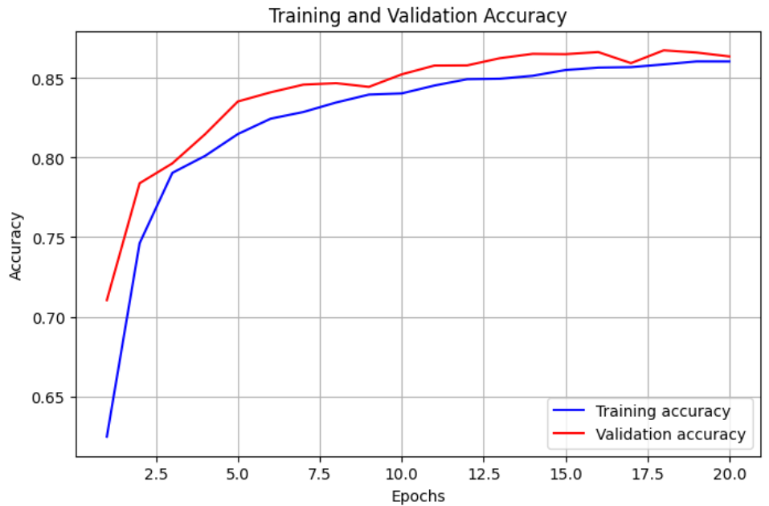
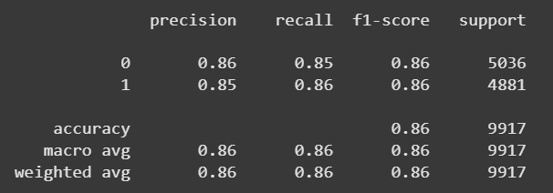
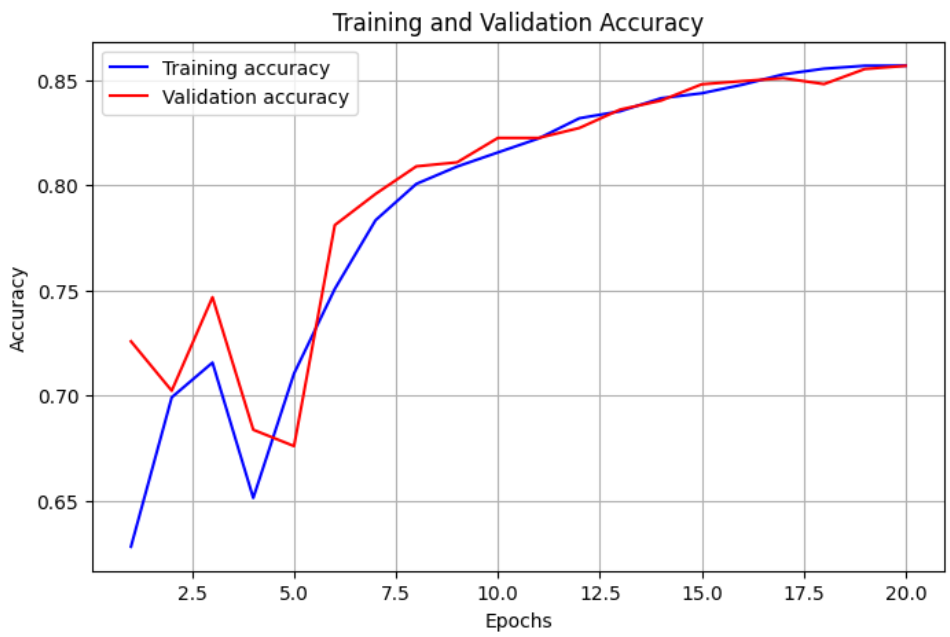

# IMDB Movie Review Sentiment Classification with Shallow RNN and (Bi)LSTM

 While humans can easily sense the meaning and emotion of a text in many circumstances, machines find it substantially more difficult. In this project, we have designed three Neural Network models for the task of text classification where we classify movie reviews.

## Dataset and Data Processing
In the realm of Natural Language Processing (NLP), the integrity and efficiency of datasets wield profound influence over the performance of different Deep Recurrent Neural Network (RNN) models.

The dataset is an **IMDB Dataset**, containing **50,000 reviews** along with their **sentiment** tags. All the reviews were tagged either **positive** or **negative** and our models are going to work on this very classification of (text) reviews.

However, large datasets like ours often conceal repetitive data, which can significantly impact a model's effectiveness. Repetitive data not only burdens computational resources but also skews the learning process by introducing redundancy. Moreover, imbalanced datasets pose a challenge in machine learning because they contain a significant difference in the number of instances between different classes. This disproportion can adversely impact the learning process and model performance. Hence, it is a good idea to pre-processing and remove the redundant data and check in on the overall condition of the dataset.

Therefore, after loading the IMDB dataset using pandas:
- Firstly, we check if the data is balanced by plotting the unique sentiment labels on a pie chart. We found a balanced result.

- Secondly, we searched for unique texts within the reviews’ column and removed the duplicate ones.

Now we can finally start working on our unique set of data.

We have converted all the positive and negative labels of the sentiments into 0s and 1s. For converting the texts into vectors, we were instructed to use a pre-trained embedding file **GloVe** of dimension **100**. We used **10000** max features and **maxlen = 256** to calculate the embedding matrix which later serves as a dictionary of weights for our tokens.

For Training and Testing, we have split our dataset into **80%–20%** as asked by the project guidelines.

## Model Building and Evaluation

### Shallow RNN Model
As instructed, we built our first model with one embedding layer and two dense layers. **Epochs = 20** and we got optimal results with a **batch size of 100**.

- **Layer 1:** We made the embedding layer untrainable as we used the previously constructed Embedding Matrix (using GloVe) to get weight for our tokens. Thus, we converted the words (max_features) into numbers in the first layer. Then we implemented a **flattening layer** to convert the sequential output of the embedding layer into a format that can be processed by subsequent dense layers.
- **Layer 2:** This dense layer consists of **10 neurons** and uses **tanh** as its activation function with **40% dropout**. We previously tried using **ReLU** in the layer, but the model was underfitting.
- **Layer 3:** Finally, in the output layer, we used the **sigmoid** activation function to map the final output of the model into probability space, between **0 and 1**.

We received the following results, evaluating the performance of our shallow model. The **F1 score** we received at different runtimes ranged from **74%–75%**.

**Figure: Performance of Shallow Model**  

Observing our training and validation accuracy curves, we deduced that our shallow model is a bit **overfitting**, but we couldn’t get better results by changing the batch size or dropout rate. So we decided to stick to it.

**Figure: Training and Validation Accuracy Graph of Shallow Model**  

### Unidirectional LSTM Model
Now we implement a **Unidirectional LSTM** model. The Embedding Layer and Output Layer of the model remain the same as the previous one. Only the second dense layer is replaced with an **LSTM** layer in this model. **30% dropout** and **batch size = 200** provide us with a satisfactory result. We received an **F1 accuracy of 86%–87%** here, which is significantly higher than that of the Shallow model. Introducing gated recurrence relation to the model really left us with an impressive improvement.

**Figure: Performance of Unidirectional LSTM Model**  

**Figure: Training and Validation Accuracy Graph of Unidirectional LSTM Model**  

### Bidirectional LSTM Model
Now we implement our final **Bidirectional LSTM** model. The Embedding Layer and Output Layer of the model too remains the same as the shallow model. Only the second dense layer is replaced with a **Bidirectional LSTM** layer in this model. **10% dropout** and **batch size = 200** provide us with a satisfactory result. We received an **F1 accuracy of 86%–87%** here. This model performed as good as the unidirectional LSTM one. In some runtimes it provided up to **88% accuracy**.

**Figure: Performance of Bidirrectional LSTM Model**  

**Figure: Training and Validation Accuracy Graph of Bidirectional LSTM Model**  

## How to improve these results
To further enhance the results of this project, several avenues for improvement can be explored. First and foremost, fine-tuning hyperparameters such as learning rates, dropout rates, epochs etc. could optimize model performance. Additionally, experimenting with more complex neural network architectures such as **unidirectional and bidirectional GRU** can bring us better performance accuracies. Not only that, as a GRU unit is lighter than an LSTM unit, it can be computationally more efficient and less time consuming. Incorporating **attention mechanisms** or exploring **ensemble methods** may unveil hidden patterns in the data.
